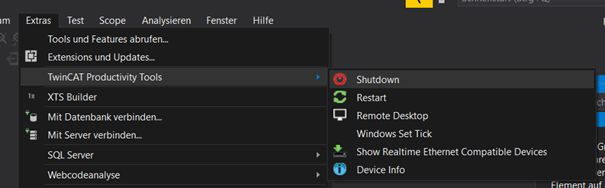
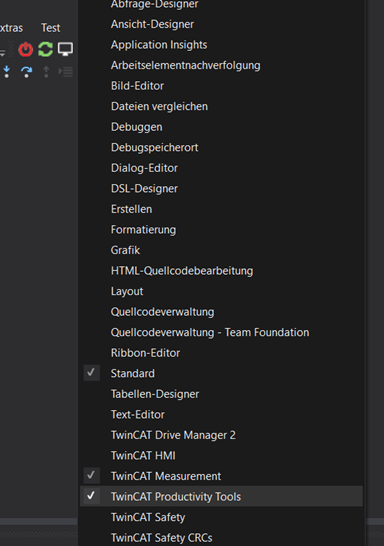
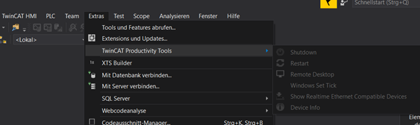

# TwinCAT.ProductivityTools
Visual Studio Extension for higher productivity when working with TwinCAT 3.1 from Beckhoff

## Installation

1. Execute the TwinCAT.ProductivityTools.vsix file
2. Select Visual Studio version

## Features

- Remote Shutdown / Reboot of the selected target
- Open a RDP connection to the selected target
- Execute the win8settick.bat on the selected target
- Remote installation of the TwinCAT real-time driver
- Reading the device information (TwinCAT, OS, Image, installed TwinCAT Functions, etc.)

## Usage

TwinCAT.ProductivityTools uses the selected target of a TwinCAT XAE project Without an open TwinCAT XAE project the buttons are hidden. When starting a VS Solution with a TwinCAT XAE project they are automatically displayed.
The use of the local target system is deactivated, e.g. to avoid a shutdown of the own operating system.

## License
[MIT](https://choosealicense.com/licenses/mit/)
