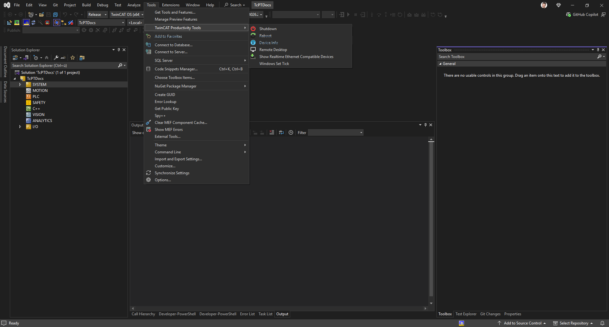

# Documentation

TwinCAT.ProductivityTools is a Visual Studio extension that adds the commands to TwinCAT XAE that
the engineering environment does not offer itself. Everything it does is reachable from the place
where you already are: the context menu of the item you selected, or the
**Tools ▸ TwinCAT Productivity Tools** menu.

## Contents

| Page | What it covers |
| --- | --- |
| [Installation](installation.md) | Installer, TwinCAT Package Manager, manual VSIX |
| [Freeze project](freeze-project.md) | Pinning TwinCAT, compiler and library versions |
| [XAE project commands](project-commands.md) | Relative AmsNetIDs, logged events, build artifact cleanup |
| [PLC commands](plc-commands.md) | Removing comments and regions, opening in VS Code or Explorer |
| [I/O commands](io-commands.md) | Enabling the ADS server, the I/O mapping window |
| [Target commands](target-commands.md) | Shutdown, reboot, device info, remote desktop, real time driver, tick |
| [Options](options.md) | Everything under Tools ▸ Options |
| [PLC project template](plc-templates.md) | "Standard PLC Project Optimized Defaults" |

## Where the commands live

| Location | Commands |
| --- | --- |
| Context menu of the TwinCAT XAE project | Freeze Project · Use relative NetIds · TwinCAT Logged Events · Delete build artifacts on clean |
| Context menu of a PLC object, folder or project | Remove all comments · Remove all regions |
| Context menu of a PLC folder | Open in Visual Studio Code · Open in File Explorer |
| Context menu of an EtherCAT master | Enable ADS Server |
| Context menu of an I/O mapping | Show IO Mappings |
| **Tools ▸ TwinCAT Productivity Tools** | Shutdown · Reboot · Device Info · Open Remote Desktop · Show Realtime Ethernet Compatible Devices · Windows Set Tick |
| **TwinCAT Productivity Tools** toolbar | Shutdown · Reboot · Remote Desktop |

Every command is hidden while it cannot do anything. A command that needs an active TwinCAT XAE
project does not appear in a solution without one, and a command that needs a target AmsNetID does
not appear before the project has a valid one. That is why the menu can look different from the
screenshots in these pages.

## Reporting

Commands never open a message box to tell you that they succeeded. They write to the status bar,
and they log details into the **TwinCAT Productivity Tools** pane of the output window. When a
command fails, the pane holds the exception; the status bar and, for destructive operations, a
confirmation dialog are the only interruptions you get.
