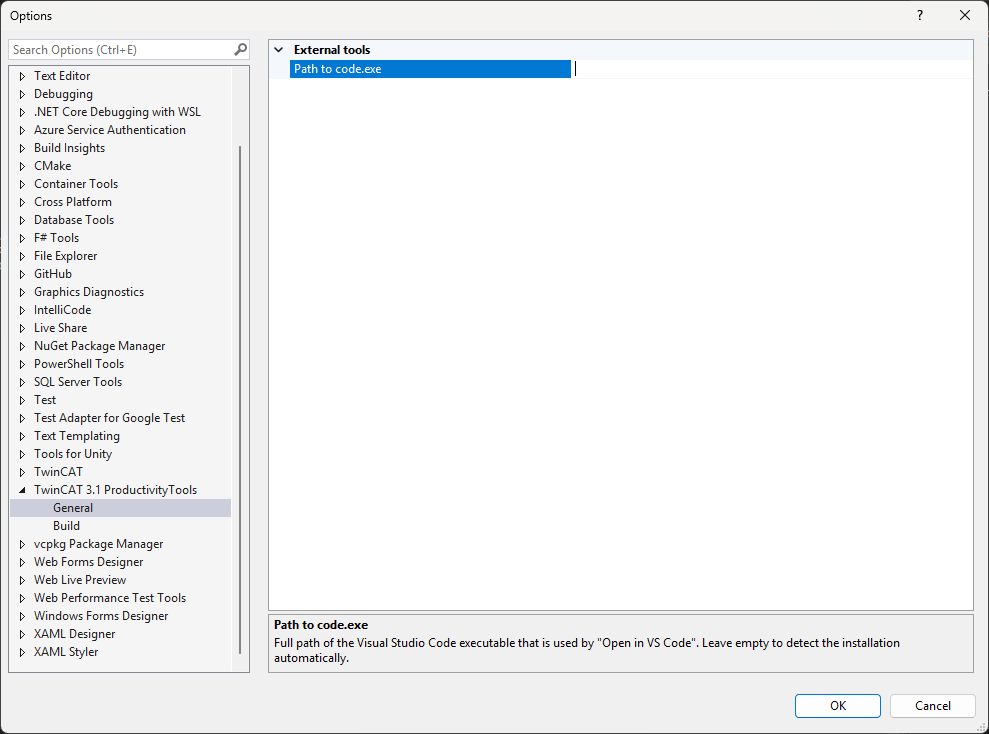
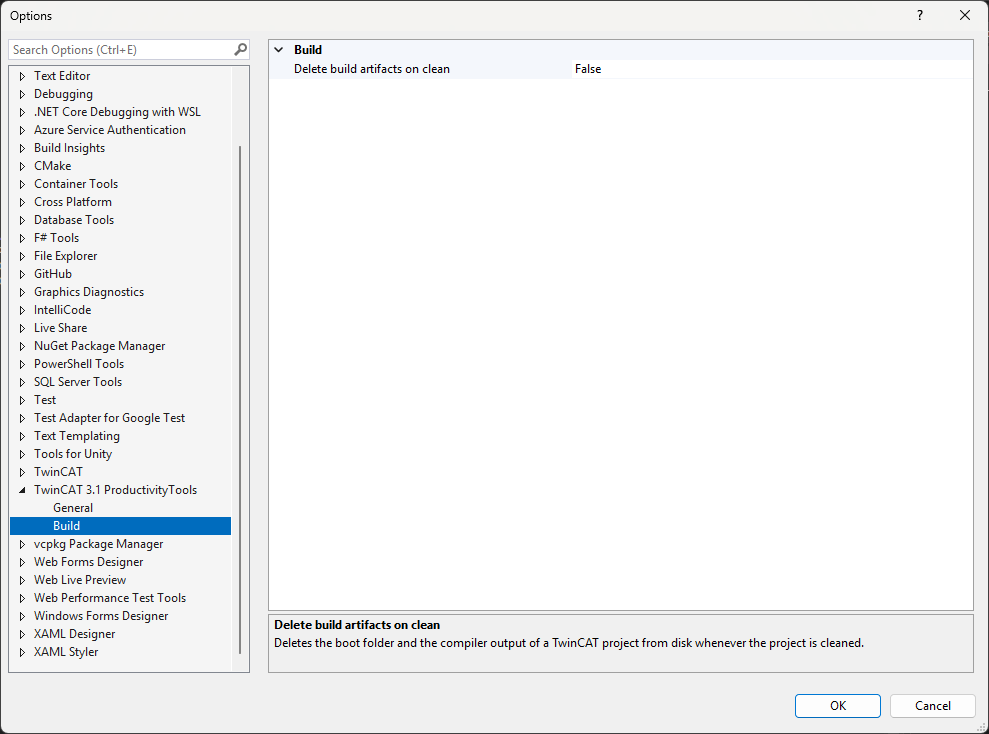

# Options

**Where** — **Tools ▸ Options ▸ TwinCAT 3.1 ProductivityTools**.

The settings are Visual Studio options, so they are stored per user and per IDE instance, not per
solution. They are included in **Tools ▸ Import and Export Settings**.

---

## General

| Setting | Default | Meaning |
| --- | --- | --- |
| Path to code.exe | empty | Full path of the Visual Studio Code executable used by [Open in Visual Studio Code](plc-commands.md#open-in-visual-studio-code). |
| SSH user name | `Administrator` | User name that [Connect to Target](target-commands.md#connect-to-target) uses when it opens an SSH session on a TwinCAT/BSD or TwinCAT/Linux target. |

Leave the path empty to let the extension detect the installation. It looks at the registry key of
the "Open with Code" shell integration first, then at `PATH`, then at the per user installation
directory, and stores what it found here. Set the value by hand to pin a specific installation —
a portable copy, or one of several side by side.

The extension connects over SSH as `<user>@<address>`. `Administrator` is the account every
Beckhoff image ships; change it when your images are provisioned with a different one. A user name
that carries a space, an `@` or a leading dash is refused, because it would turn into a second
argument of the SSH client.

---

## Build

| Setting | Default | Meaning |
| --- | --- | --- |
| Delete build artifacts on clean | off | Deletes the boot folder and the compiler output of a TwinCAT project from disk whenever the project is cleaned. |

The same switch is on the context menu of the TwinCAT XAE project, see
[Delete build artifacts on clean](project-commands.md#delete-build-artifacts-on-clean). Both write
the same setting; the context menu entry carries a check mark that shows its state.

The option is off by default because it deletes files from disk. Turn it on when a stale `_Boot`
folder being deployed on the next activation would be worse than rebuilding from scratch — which
is the case in most repositories.
